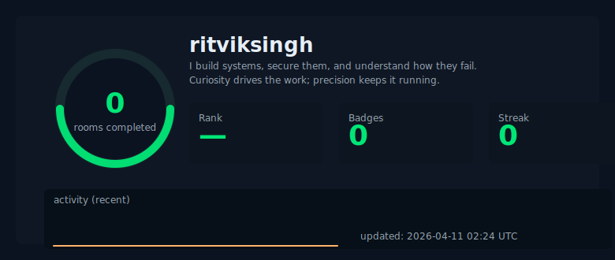

`hi, i'm ritvik.`  
`cyber security analyst`  
`4th year b.tech cse student`

`i build systems, secure them, and understand how they fail.`  
`curiosity drives the work; precision keeps it running.`

---

> [!IMPORTANT]
> primary email: [`singhritvik1411@gmail.com`](mailto:singhritvik1411@gmail.com)    
> **Portfolio:** [`ritviksingh.in`](https://www.ritviksingh.in)  
> **LinkedIn:** [`ritviksingh`](https://www.linkedin.com/in/ritviksingh14/)  
> **Medium:** [`ritviksinghx`](https://medium.com/@ritviksinghx)

---

> [!NOTE]
> ➜ discord: [`GunmaN`](https://discord.com/users/391238523501543425)  
> ➜ steam: [`GunmaN`](https://steamcommunity.com/profiles/76561199080523321/)  
> ➜ tryhackme: [`ritviksingh`](https://tryhackme.com/p/ritviksingh)  

---

  
<strong>expand to view my TryHackMe stats</strong>

   

  

    <a href="https://tryhackme.com/p/ritviksingh" target="_blank" rel="noopener">
      <!-- use width attribute to constrain; the style attribute may be stripped by GitHub but width is safe -->
      
    </a>
  

---

### Tech Stack

> **Cybersecurity**  
> Wazuh • MISP • ThreatSpike • IDS/IPS • VirusTotal API • YARA • FIM • SOC workflows

> **Pentesting**  
> Burp Suite • Metasploit • Nmap • Postman • BloodHound • SharpHound

> **Development**  
> Python • FastAPI • JavaScript • HTML/CSS • React • Node.js

> **AI / ML**  
> PyTorch • TensorFlow • Transformers • data preprocessing • model training • LLM fine-tuning

> **Tools**  
> Ubuntu • pfSense • UFW • Firewalld • Docker (basic) • Git • GitHub

---

