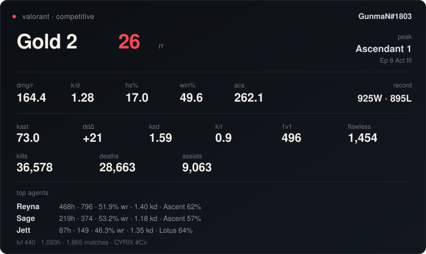

`hi, i'm ritvik.`  
`cyber security analyst`  
`b.tech cse · graduated 2026`

`i build systems, secure them, and understand how they fail.`  
`curiosity drives the work; precision keeps it running.`  
`blue team by day, break things on purpose when the lab is open.`  
`if a control looks solid on paper, i still want the packet that proves it.`

  

---

> [!IMPORTANT]
> primary email: [`singhritvik1411@gmail.com`](mailto:singhritvik1411@gmail.com)  
> **Portfolio:** [`ritviksingh.in`](https://www.ritviksingh.in)  
> **LinkedIn:** [`ritviksingh`](https://www.linkedin.com/in/ritviksingh14/)  
> **Medium:** [`ritviksinghx`](https://medium.com/@ritviksinghx)

---

> [!NOTE]
> ➜ discord: [`GunmaN`](https://discord.com/users/391238523501543425)  
> ➜ steam: [`GunmaN`](https://steamcommunity.com/profiles/76561199080523321/)  
> ➜ tryhackme: [`ritviksingh`](https://tryhackme.com/p/ritviksingh)  
> ➜ valorant: [`GunmaN#1803`](https://tracker.gg/valorant/profile/riot/GunmaN%231803/overview)

---

### currently

> building and hardening [`Sentinel`](https://github.com/r1tv1kx/Sentinel) + [`safesphere`](https://github.com/r1tv1kx/safesphere)  
> designing the [`DLP`](https://github.com/r1tv1kx/DLP) architecture end to end  
> running hid / blue-team labs in [`digispark-hid-attack-lab`](https://github.com/r1tv1kx/digispark-hid-attack-lab)  
> writing when a finding is worth keeping on [`medium`](https://medium.com/@ritviksinghx)

---

  
  

  

  
  

  
  

  

---

### Focus

> **SOC / detection** — wazuh, misp, fim, log noise into signal  
> **offensive** — nmap, burp, bloodhound; map paths, prove the gap  
> **build** — python tools that cut the boring parts of an investigation  
> **write** — short notes when the lesson survives a second pass

---

### Some things i've shipped

> ➜ [`Sentinel`](https://github.com/r1tv1kx/Sentinel) — plain-english website security scan, subdomains, fake-link checks  
> ➜ [`safesphere`](https://github.com/r1tv1kx/safesphere) — personal ai cybersecurity: think before you click  
> ➜ [`DLP`](https://github.com/r1tv1kx/DLP) — enterprise data loss prevention architecture and design  
> ➜ [`digispark-hid-attack-lab`](https://github.com/r1tv1kx/digispark-hid-attack-lab) — digispark hid lab for defensive awareness (SilentStrike)  

`more on `[`github.com/r1tv1kx`](https://github.com/r1tv1kx?tab=repositories)` and `[`ritviksingh.in`](https://www.ritviksingh.in)

---

### Tech Stack

> **Cybersecurity**  
> Wazuh • MISP • ThreatSpike • IDS/IPS • VirusTotal API • YARA • FIM • SOC workflows

> **Pentesting**  
> Burp Suite • Metasploit • Nmap • Postman • BloodHound • SharpHound

> **Development**  
> Python • FastAPI • JavaScript • HTML/CSS • React • Node.js

> **AI / ML**  
> PyTorch • TensorFlow • Transformers • data preprocessing • model training • LLM fine-tuning

> **Tools**  
> Ubuntu • pfSense • UFW • Firewalld • Docker (basic) • Git • GitHub

---

### hobbies

> **valorant** — competitive queues as [`GunmaN#1803`](https://tracker.gg/valorant/profile/riot/GunmaN%231803/overview) · ap · gold grind  
> **steam** — nights on [`GunmaN`](https://steamcommunity.com/profiles/76561199080523321/)  
> **labs** — tryhackme rooms when the brain wants puzzles, not tickets  
> **writeups** — short posts when a round or a lab teaches something sticky  

  

---

### looking for

> security engineering / soc / purple-team conversations  
> feedback on detection design and practical tooling  
> collaborators who like building things that earn their keep  

`mail: `[`singhritvik1411@gmail.com`](mailto:singhritvik1411@gmail.com)` · `[`ritviksingh.in`](https://www.ritviksingh.in)

---
